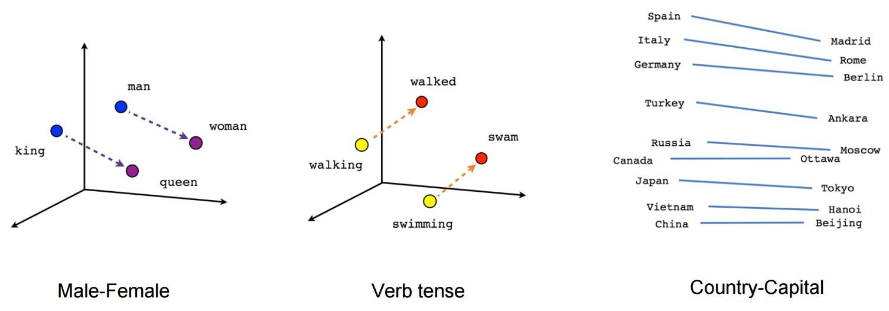
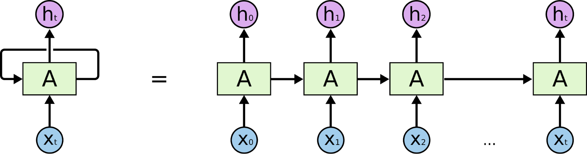
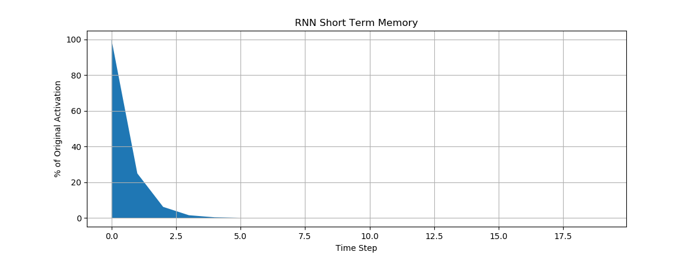
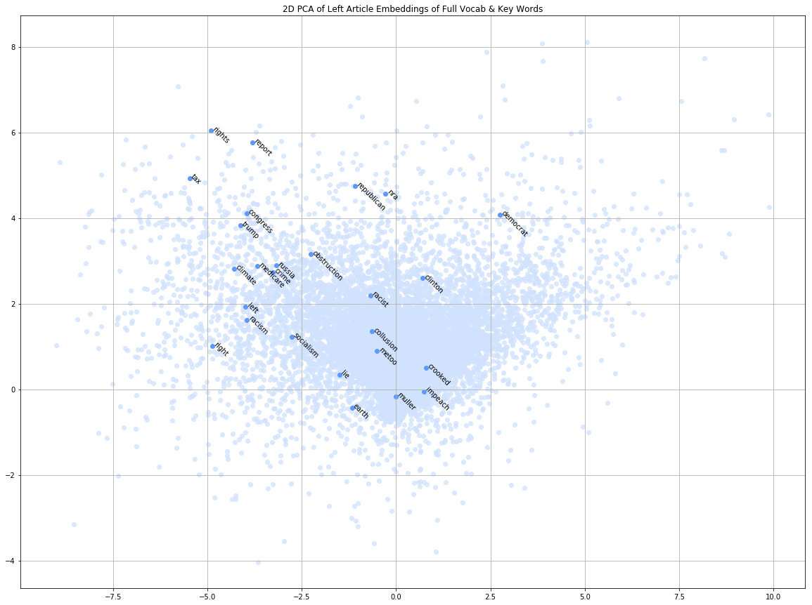
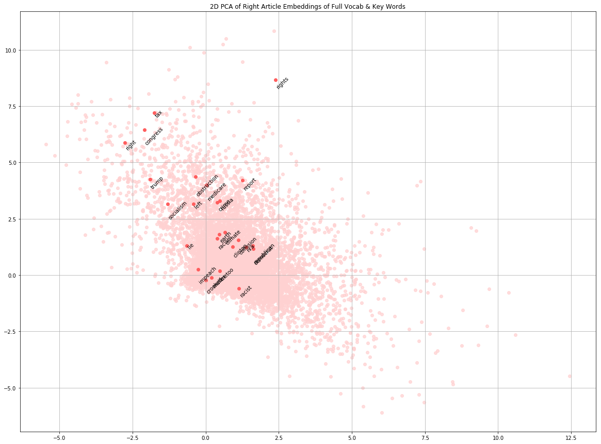
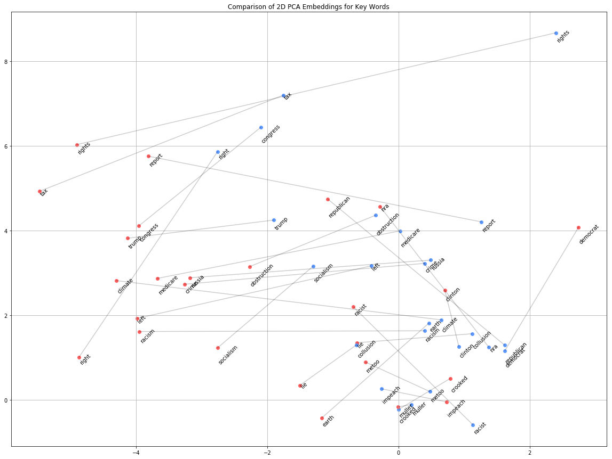
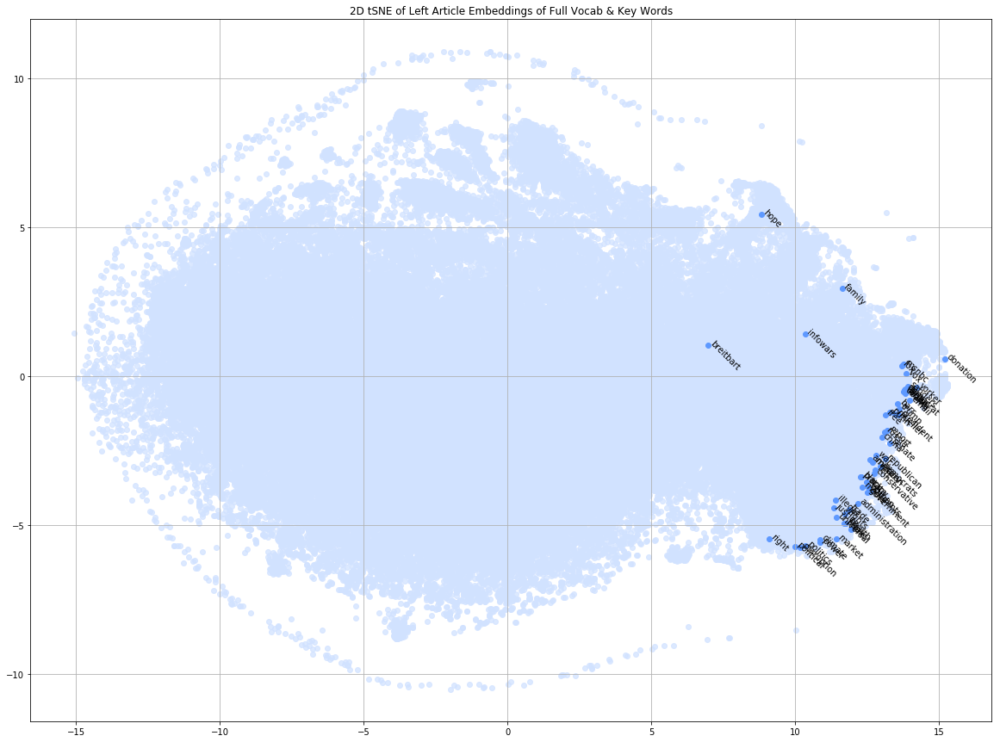
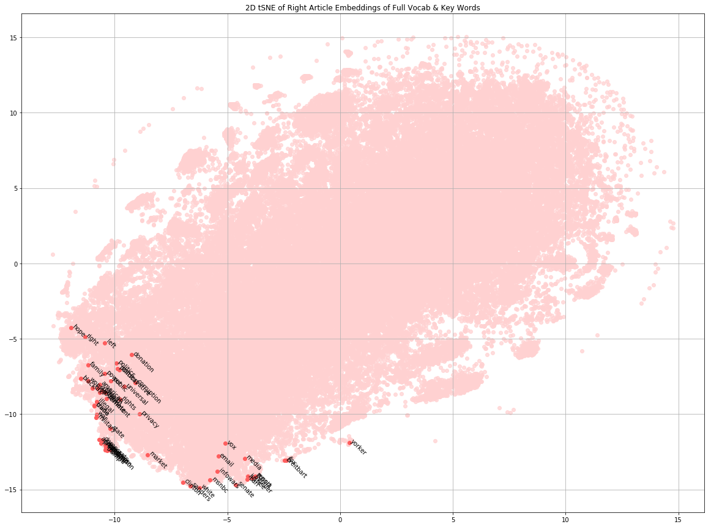

# PoliticalTextClassification

For my conference, I created an LSTM neural network to classify the political biases of news articles. I had a few potential conference topic subjects at the beginning of the semester but ultimately chose to research and experiment with subjects relating to natural language processing (NLP).

Neural networks can’t understand text the way people do. To a computer, text is just a string of symbols. Neural networks require that you pass in input information as numbers. Therefore, an important early step in any NLP task is tokenizing and encoding. Tokenization is the process of splitting up one long piece of text based on some set of rules. Usually, it involves splitting the text into words, but text could also be split into other units such as sentences or characters. Tokenization can be a somewhat simple process but there is still a certain level of complexity when deciding where and how to split text – especially with regards to punctuation. Additionally, the tokenization process can be taken a step further by lemmatizing text, which involves simplifying words to their most basic form (i.e. removing tense, pluralization, etc.), since to a computer two versions of the same word are completely different whereas humans would generally see them as being very similar.

Once the text has been split into tokens, it can be encoded, by converting those tokens into some type of numeric representation. There are many different ways to go about doing this. The simplest being assigning each word in your vocabulary an index number. Still, this doesn’t do the network any favors when it tries to learn the relationships between words. These numbers only act as placeholders and don’t actually contain any information about the words themselves. Other approaches have been devised to embed information about a word in their numeric representations. The most popular algorithm for doing so is probably Word2Vec, which was created by Thomas Milkolov at Google. Word2Vec is actually a shallow 2-layer neural network which uses word context to place words in n-dimensional vector space in a way that groups similar words together. In addition to clustering similar words, Word2Vec aims to preserve word relationships based on their relative positions. Therefore, it’s possible to perform math on these vector representations. A common example used to illustrate this idea is that the vector representation for the word “king,” minus the vector for “man,” plus the vector for “woman,” is about equal to the vector for the word “queen” (in the Word2Vec model trained on Google’s scrape of the web, the result isn’t exactly that of the vector for the word “queen” but “queen” is the closest vector in vector space).

[_Source_](https://www.tensorflow.org/tutorials/representation/word2vec)

An additional benefit of using a word embedding such as this, is that the network can save space. Rather than passing in a vector of potentially thousands of zeros and one “1” (also known as a one-hot vector), in which each digit represents the presence or absence of a word in the vocabulary, a word embedding like Word2Vec can represent a word with a considerably smaller vector (often around 150 but it could be far fewer). These are also referred to as “sparse” versus “dense” vectors.

Once the text has been converted into a form that can be understood by a neural network, it’s time to build our model. Traditional neural networks handle each sample in isolation. They have no concept of order or sequence. At any given time-step, the network can’t learn from the context of past information. A common form of text encoding which ignores word order is called the “bag of words.” This would produce a vector with a length equal to the number of words in the corpus vocabulary (assuming the text is a subset of the data being trained on), where each number would be either a “0” or a “1” representing the absence or presence of the corresponding word in the text. The issue with this type of representation is that order and context are supremely important in understanding meaning. To demonstrate with a rather reductive example, the statement, “the movie was excellent and not at all awful,” when compared with, “the movie was awful and not at all excellent” are constructed with the same words and therefore would have the same vector representation, even though their semantic meanings are diametrically opposed.

A Recurrent Neural Network (RNN) is a type of neural network that was developed to handle sequential data. RNN layers work by combining their current input with their activation from the past time step. This way, as time progresses, the network is able to take into account the information that has come before. The following diagram shows an RNN and its “unrolled” representation. The output at time step 2 is not only based on the input, “X2”, but also on the networks “memory” from “X1” and “X0”.

[_Source_](http://colah.github.io/posts/2015-08-Understanding-LSTMs/)

While RNNs are successfully able to learn sequential data in simpler problems, in practice, RNN’s unfortunately have a hard with time learning less trivial sequential information. Specifically, they have trouble with long-term dependencies. For example, they can be taught to predict the last word in the sentence “the clouds are in the sky” but they have trouble with carrying that contextual information further along in a problem such as trying to predict the last word in the following text: “I grew up in France…I speak fluent French.” This is because as time progresses, the influence of earlier steps gets considerably weaker and weaker over time. The graph below shows how the influence of an earlier input as time progresses.

In response to the issue of long-term dependencies, the Long Short Term Memory (LSTM) Network was created. Each LSTM layer is made up of four inner layers, a cell state, and a series of gates. The cell state is the information passed in from the previous time-steps and which are passed along to the following time-step, relatively unchanged. The layers and the gates are used to decide what to “forget” from the old information, what new information to “remember” in the cell state, and what to output at the current time-step. The structure of an LSTM is shown in the diagram below.

[_Source_](http://colah.github.io/posts/2015-08-Understanding-LSTMs/)

For my experiment, I gathered web articles from groups of left-leaning and right-leaning news organizations. From the left, I used sources like MSNBC, Vox, Jacobin, Democracy Now!, the New Yorker, and Mother Jones. From the right, I used sources including the Drudge Report, Breitbart, Fox News, National Review, the Blaze, and RedState. 

Initially I used the Python library “Scrapy” to gather information. It works by extending a parent, Spider class, in which you define a few attributes such as starting URL, allowed domains, and which information to scrape from a site. In addition, you can create secondary methods to be called by the primary scraper function. I had my spider look though the websites and pull article links, using their XPaths, which it passed to a secondary scraper method which would scrape the text from the article. The data could then be saved as a JSON file which I would add to the SQLite database containing all of the articles I scraped.

This technique did a good job of extracting articles in a clean way but since this was my first time using Scrapy, there was a bit of a learning curve. The most challenging part was finding the right XPath combinations for each news site. In the end, I found it to be a bit too time consuming for the number of articles I was able to collect, so I opted for creating a simpler but rougher web scraper myself, using Requests and Beautiful Soup. It worked similarly, by going to a chosen starting URL, where it extracted all of the “<a>” tags’ links and added them to a queue. Then it went to each of those queued links, extracted all of the text in the pages’ “
” tags, and put the “<a>” tags’ links that it hadn’t already visited into the queue. It continued until it had either run out of links to search or had hit a set depth limit (I generally used a depth of 3 iterations). The data wasn’t as clean, but I was able to create new scrapers quickly and gather a lot of data from each site. I decided to use this data as well, even if the data I gathered this way wasn’t as clean, since it would still potentially contain biased text, even if not in article form.
  
After I scraped my text, I tokenized the articles, replaced the words with numbers (based on their key in a vocab dictionary), removed all articles with less than 20 words, and padded the rest of the articles so that they were all vectors of length 10,000. Then I split my data up into training, testing, and validation groups. The first layer of my network was a Keras Embedding layer which converted each word into the article to a vector of length 100 and learned the embedding as the network was trained. Then I added a Dropout layer set to 20%. Then that was connected to a Conv1D layer and a MaxPooling1D layer – since I in my research I read that CNN layers can help boost the strength of RNN networks in performing NLP tasks – which had 32 filters, a kernel size of 3, and a pool size of 2. That was followed by another Dropout layer (also set to 20%) and fed into my LSTM layer with a size of 100. That fed into a single Dense activation unit. The network used binary cross-entropy as a loss function (to classify the “right-ness” of an article) and Adam as an optimizer. 
  
When training, I found that the network was able to reach its peak performance of about 97% accuracy on the validation data within 3-5 epochs (with a batch size of 64) and scored similarly on the testing data. 
  
I’ve continued to test the network a bit further on new articles from the same sources and a few others. It seems to be fairly generalizable but not perfect. Based on the results I’ve observed, it seems the network has a harder time classifying articles about subjects it hasn’t seen before. I’m not sure if that’s due to a flaw in the network’s design, a lack of longer-term consistent data, or if it shows something about the differences in language between left-leaning and right-leaning news sources. I would need to continue to experiment further with different network designs and with more data.

In addition to my news-article-political-bias classifier, I also experimented with a few other ideas throughout the semester. I attempted to train a similar network to classify political bias in tweets. Unfortunately, it wasn’t able to adequately learn the task. I built it in the same way as my article classifier and experimented with different hyperparameters – layer size, including a 1D convolutional layer and max-pooling layer, adding another LSTM layer, dropout values – but I wasn’t able to get an accuracy score above about 75%. I suspect the reason for this comes down to tweet length compared to article length. Not only are tweets limited to 280 characters, but most people hardly reach that limit. The average tweet length in my corpus was 112 characters, which still doesn’t account for the parts of the tweets that have to be removed in the cleaning and pre-processing phase, such as URLs (twitter short URLs are 23 characters each).

I also experimented with visualizing text embeddings. Since the vectors created to represent these words are fairly high-dimensional and humans have a hard time visualizing, let alone understanding, anything with more than 3 dimensions, it becomes necessary to perform dimensionality reduction to present the information in a human-digestible way. There are many different methods for performing dimensionality reduction. I tried two methods PCA and t-SNE. The first, Principal Component Analysis (PCA), is the main linear technique for dimensionality reduction. It works by mapping the data to a lower-dimensional space in order to maximize the variance of the data. The second, t-Distributed Stochastic Neighbor Embedding (t-SNE), is non-linear, uses manifold learning, and is based on the idea that the dimensionality of many datasets is only artificially high. It is essentially trying to “find” a 2-dimensional (or at least lower-dimensional) plane, that is warped around in various ways, within the higher dimensional space, on which the data can be viewed.

I created two separate Word2Vec models: one trained on the left corpus and the other trained on the right corpus. Then I used PCA and t-SNE to reduce the words’ vector representations to 2 dimensions so that they could be plotted. The following graphs show the result of the PCA-reduced left and right datasets. In both graphs the full vocabulary is plotted in pale blue and red, respectively, where each point is a word that has been reduced by performing separate PCA dimensionality reduction on their individual Word2Vec word embeddings. I’ve also highlighted a selection of key words on each graph, such as “Trump,” “Russia,” “tax,” “socialism,” “NRA,” and “obstruction.” There unfortunately don’t seem to be any clear-cut, interesting conclusions to be drawn, but it can be interesting to examine the different ways the separately trained models placed the same set of words in vector space.

The following graph shows the relationships between the placements of the keywords for the left and right embeddings. I added lines connecting the different embeddings of the same word.

It should also be noted that since the embeddings for the left and right articles were learned separately, I don’t believe their relationship to their counterpart is significant, just the comparative relationships.

When I graphed the t-SNE reduced vectors, though, I got some surprising results. Below are the graphs of their vocabularies.

It appears that for both the left and right vocabs, the t-SNE algorithm has grouped all of the keywords together, near one edge of the cluster of words. It hardly seems coincidental. When I investigated further, I found that there doesn’t seem to be a clear semantic reason behind the placement. My best guess at the relationship being illustrated here, is word frequency. When I plotted other semantically unimportant words like “and”, “or”, and “the,” they generally appeared near the keywords. When I looked at the words plotted on the opposite side of the vocabulary cluster, I found a lot of broken word fragments – things that don’t seem to actually be part of an article but are instead noisy garbage text that was picked up during the web scraping; things like URL fragments or gibberish characters. I had hoped to find some insight about the difference between the vocabularies of left-leaning and right-leaning news sources that the model had picked up on. While that’s not what I found, it’s nevertheless interesting to see this representation and to see that the dimensionality reduction algorithm seems to have picked up on what is clearly an important feature (albeit a lower level and non-semantically-significant feature).

I ultimately learned a lot about using neural networks with text data and specifically how to implement NLP tasks with recurrent neural networks. Moving forward I’d like to continue to explore the subject, by working with cleaner data, gathered more consistently, over a longer period of time, as well as exploring more advanced LSTM implementations (such as bi-directional RNNs), and using sequence-2-sequence models to build conversational agents.
