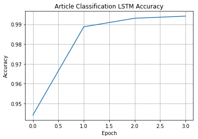
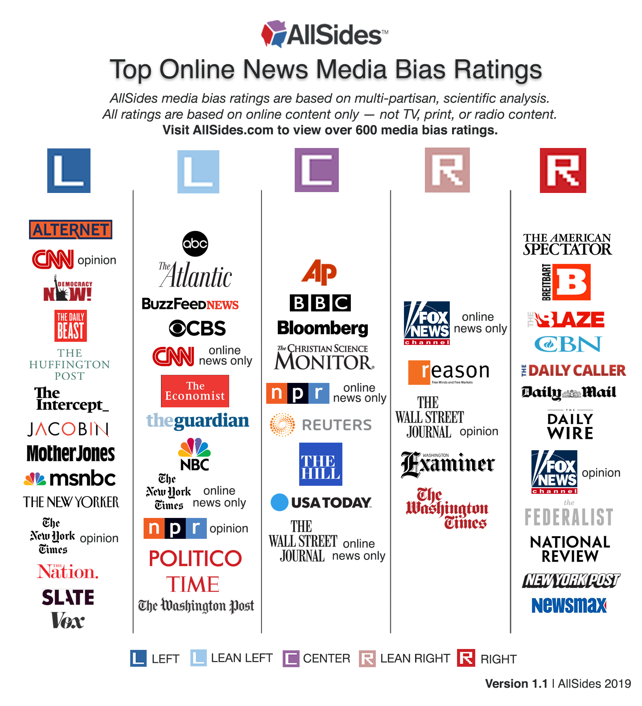

# Political Text Classification with LSTMs

### Summary

I created this model at Sarah Lawrence College as part of my conference work for the class [Bio-Inspired Artificial Intelligence](http://science.slc.edu/jmarshall/bioai/) taught by Prof. Jim Marshall.

This was an attempt to create a model that would be able to classify news articles as being either right-leaning or left-leaning based on their content.

### Process

I built a simple tool for scraping news articles to build my dataset. It uses Requests and BeautifulSoup to search through sites and recursively download the text from the pages' links. `SiteScraper.py` has the webscraper and `addToArticleDB.py`. The scraper works by starting at a source url and grabbing all of the links in <a> tags on that page. From there it goes to each of those sites and concatenates all of the text in paragraph tags and saves that to the database. It also adds all of the <a> tag links (that haven't already been visited) to the queue of links to check. It continues on in these cycles until it either runs out of links to check or reaches the specified cycle limit.

The file `fullArticleLSTM.py` builds the model and trains it on the articles in `db/articles.db`. It also tokenizes the articles and converts the string tokens to numerical encodings. The numberical encodings are stored in the sqlite database: `db/text_encoder.db`.

I tested the model using a few different architectures (using multiple combinations of LSTMs and Convilutional layers) but found that the best results seemed to come from the above setup and other versions with more layers only added to the training time and didn't improve the results.

Additionally, in order to convert the integer encodings into learned embeddings, I chose to use a Keras Embedding layer that would learn as the model trained, rather than using a standalone method such as Word2vec or GloVe.

Once built, the model has the following structure:

```
_________________________________________________________________
Layer (type)                 Output Shape              Param #   
=================================================================
embedding_1 (Embedding)      (None, 10000, 100)        17328600  
_________________________________________________________________
dropout_1 (Dropout)          (None, 10000, 100)        0         
_________________________________________________________________
conv1d_1 (Conv1D)            (None, 10000, 32)         9632      
_________________________________________________________________
max_pooling1d_1 (MaxPooling1 (None, 5000, 32)          0         
_________________________________________________________________
dropout_2 (Dropout)          (None, 5000, 32)          0         
_________________________________________________________________
lstm_1 (LSTM)                (None, 100)               53200     
_________________________________________________________________
dense_1 (Dense)              (None, 1)                 101       
=================================================================
Total params: 17,391,533
Trainable params: 17,391,533
Non-trainable params: 0
_________________________________________________________________
```

It was able to achieve fairly good accuracy after about 5 epochs as you can see in the following graph. The best result was an accuracy of about 99% on the test set.



### Article Sources

Chosen based on articles such as [this one](https://www.allsides.com/media-bias/media-bias-chart) from AllSides, which describe the media-biases of news sources. The following graphic from their site, shows how they categorize news sources.



_source: [https://www.allsides.com/media-bias/media-bias-chart](https://www.allsides.com/media-bias/media-bias-chart)_

Here's a list of the sources I used (in no particular order):

| Left Sources | Right Sources |
| -------------|---------------|
| MSNBC | Breitbart |
| Vox | Fox |
| Jacobin | The Blaze |
| Huffington Post | Hannity.com |
| Buzzfeed | Drudge Report |
| New Yorker | National Review |
| Mother Jones | Red State |
| Washington Post | Federalist |
| Democracy Now | Twitchy |
| Salon | Weekly Standard |


### Next Steps

 * Improve the dataset! I'd like to devote some more time to cleaning up the dataset and making it more robust.
   * Since the webscraper I wrote for this project casts a fairly wide net, the model could be using clues other than the actual text of the article.
   * Use a wider range of data gathered. By only collecting data in a limited window, the model is less generalizable when it encounters news stories on topics other than those in the small window where the data was collected.
 * Increase the number of classes the model is choosing between. Instead of predicting the _right-ness_ of an article, the model could be trained to classify articles as being either Left, Center, or Right. This would involve modifying the dataset to include three categories instead of just two.
 * Modify the model architecture. I'd like to try other tools such as transformers or use transfer learning to boost the model's power.
 * Using the learned embeddings to find what aspects of the article most strongly contribute to the model's classification.
 * Use the model to classify news _sources_ as being either politically left, center, or right, depending on their articles.
 * Using this model, try to classify tweets as being either left-, center-, or right-leaning.

### Instructions to Run

I've included the pickled & processed articles, compressed versions of the article database, the text encoder database, and a compressed model as an h5 file.

To build the model from scratch, you can use `addToArticleDB.py` to create a new article dataset (or just use the included one) and then train a new model with `fullArticleLSTM.py`.

Then – with either your trained model or the included h5 file – you can use the included Jupyter Notebook, `ModelDemo.ipynb` to test it out!


